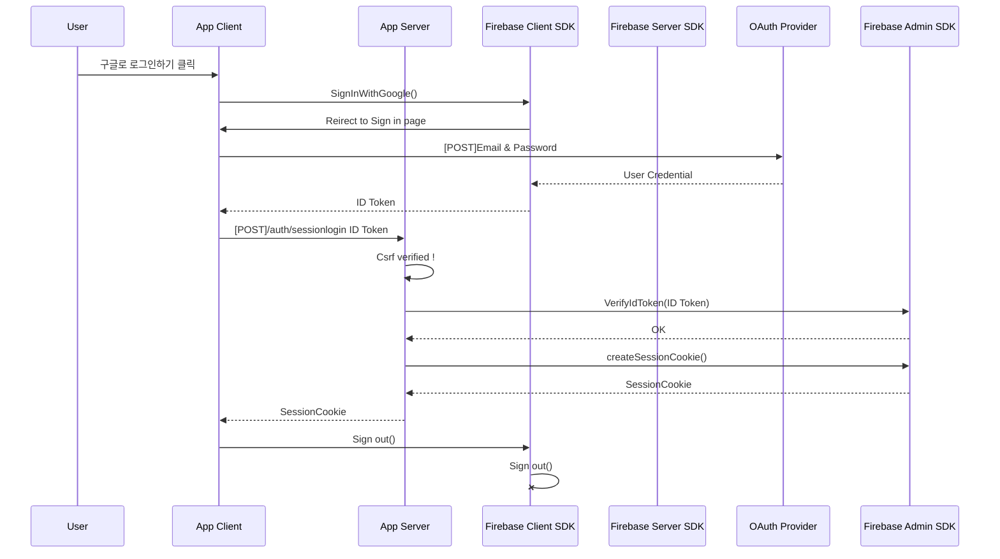

## 📌 개요


- **`프로젝트 명` :** I Pill U 리팩토링
- **`프로젝트 기간` :** 2023.08.13. - 2023.10.20.
- **`한 줄 소개` :** APP Router 기반 Server Action, RSC을 활용한 Serverless 어플리케이션
- **`배포 주소` :** [I Pill U 홈페이지](https://seb42-main-013-refactored.vercel.app/)
- **`테스트 계정` :**  `🔒 ID`  hetidom546@weirby.com `🔑 Password`  qwer1234!
  
<br/>   

## 🛠️ 기술 스택
<p>
       
 
</p>

<br/>  


## 📂 폴더 구조

```
🏠 app
├── 📂 (api)
│   ├── sessionlogin ────────────── 🍪 세션 쿠키 생성 API
│   └── csrf ────────────────────── 🪪 CSRF토큰 발행 API
├── 📂 (auth)
│   ├── 📃 login  ───────────────── 👤 로그인 페이지
│   ├── 📃 signip ───────────────── 👤 회원가입 페이지
│   └── layout.tsx
├── 📂 (home)
│   ├── 📃 @intro ───────────────── 🏠 메인페이지 1 (Parallel Routes)
│   ├── 📃 @suggest ─────────────── 🏠 메인페이지 2 (Parallel Routes)
│   │   ├── 📃 create ───────────── 📝 데이터 생성/수정 페이지
│   │   ├── 📃 mypage ───────────── 👤 유저 정보 조회/수정 페이지
│   │   ├── 📃 search ───────────── 🔍 영양제 검색 페이지 (네이버 쇼핑)
│   │   └── 📃 summary ──────────── 🗂️ 유저 데이터 조회/삭제 페이지
│   └── layout.tsx
├── 📂 compoenents ──────────────── 📦 모든 페이지에서 공통으로 사용되는 컴포넌트
└── layout.tsx
📂 context ──────────────────────── 🔐 Auth Context
📂 firebase ─────────────────────── 🔐 Firebase setup
📂 lib ──────────────────────────── 🛠️ 서버액션, helper
📂 mui ──────────────────────────── 🎨 MUI setup
📂 zodSchema ────────────────────── 🔏 유효성 검사 스키마
middleware.ts
types.ts
```

<br/>   


## 📺 시연 영상
|구글 회원가입|구글 로그인|로그아웃|세션 만료|
|:---:|:---:|:---:|:---:|
|||||
|<span>`firebase`</span> `CSRFToken` `useForm` `zod` `API`|<span>`firebase`</span> `CSRFToken` `useForm` `zod` `API`|<span>`RCC`</span></br>`server action`</br>`useFormstate`|<span>`firebase`</span> `session cookie`|


|이메일 회원가입|인증 전 로그인|인증 후 로그인|
|:---:|:---:|:---:|
||||
|<span>`firebase`</span> `CSRFToken` `useForm` `zod`| `Error handling`|`Error handling`|

|메인페이지|건강고민 탭|회원정보 수정|검색|
|:---:|:---:|:---:|:---:|
|||||
|<span>`ParallelRoutes` `skeleton`</span>|<span>`dynamic load` `placehold` `blurDataURL` `PlacierHolder`</span>|<span>`RCC` `server action` `useOptimistic`</br>`Optimistic-UI` `.bind`</span>|<span>`RCC` `SSR`</br>`NAVER API`</span>|


|영양제 조회|영양제 생성|영양제 수정|영양제 삭제|
|---|---|---|---|
|||||
|`RSC` `SSR`|`CSRFToken API`</br>`server action`</br>`useFormstate`</br>`server-onlyForm`</br>`zod` `stateless modal`|`CSRFToken API`</br>`server action`</br>`useContext`|`server action`</br>`useOptimistic`</br>`Optimistic-UI`|


<br/>


## 🔐 Auth 순서도


## :pencil2: 커밋 & 코드 컨벤션
```
[Feat] 새로운 기능 추가 
[Fix] 버그 수정 
[Design] CSS 등 사용자 UI 디자인 변경 
[Style] 코드 수정은 없지만, 코드 포맷 변경시 작성 
[Refactor] 코드 리팩토링 
[Comment] 필요한 주석 추가 및 변경 
[Docs] 문서 수정 
[Test] 테스트 및 테스트 리팩토링 코드 작성(프로덕션 코드 변경 X) 
[Chore] 빌드 업무 수정, 패키지 매니저 설정 및 수정(프로덕션 코드 변경 X) 
[Rename] 파일 및 폴더를 수정하는 작업 
[Remove] 파일 및 폴더를 삭제하는 작업 
[Init] 브랜치 초기화 및 초기셋팅 관련된 설정일 경우
```

